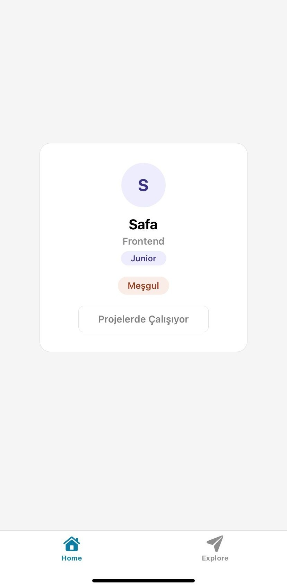

# 📱 Yazılımcı Kimlik Kartı — React Native Ödev 1 & 2

## 📋 Proje Hakkında
React Native ile geliştirilmiş oyunlaştırılmış bir kimlik kartı uygulaması.
"İşe Al" butonuyla geliştirici işe alınır, her işe alımda puan artar ve
rozetler kazanılır.

## 🎮 Oyunlaştırma Özellikleri
- 🔢 **Sayaç** — kaç kişi işe alındığını gösterir
- 🏅 **Rozet Sistemi** — 1, 3 ve 5 işe alımda farklı rozetler kazanılır
- ✨ **Buton Animasyonu** — her basışta zıplama efekti
- 💬 **İlerleme İpucu** — sıradaki rozete kaç kişi kaldığını gösterir

## 🧩 Kullanılan Kavramlar
- **Props:** `ad`, `uzmanlik`, `seviye`
- **State:** `isaAlinanlar`, `rozet`
- **Animated API** ile buton animasyonu
- **StyleSheet** ile Flexbox tabanlı modern kart tasarımı

## 💻 Kodun Son Hali (Ödev 1)
🔗 [index.tsx — GitHub Gist](https://gist.github.com/iiamseha/4bb456ec89cdeadc3bf71f5b64c17077)

## 🤖 AI Prompt Özeti (Ödev 1)
**Kullandığım Prompt:**
> "Yazdığım React Native iskelet koduna Flexbox ile ortalama,
> StyleSheet ile modern kart tasarımı, dinamik renk değişimi
> (müsait = yeşil, meşgul = turuncu) ve disabled buton durumu ekle."

**Öğrendiğim detay:**
`StyleSheet.create()` ile stiller component dışına taşınınca
kod daha temiz okunur ve React Native bunları optimize eder.

## 🚀 Nasıl Çalıştırılır?
```bash
git clone https://github.com/iiamseha/Yaz-l-mc-Kimlik-Kart---React-Native-dev-1
cd Yaz-l-mc-Kimlik-Kart---React-Native-dev-1
npm install
npx expo start
```

## 📦 APK İndir
[kimlik-karti.apk](https://expo.dev/artifacts/eas/jXoXLBWB3XHZmGmoKuksq5.apk)

## 🎥 Tanıtım Videosu
[YouTube — yakında eklenecek]

## 📸 Ekran Görüntüsü

